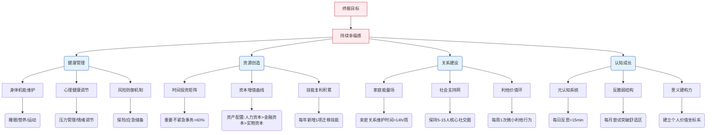
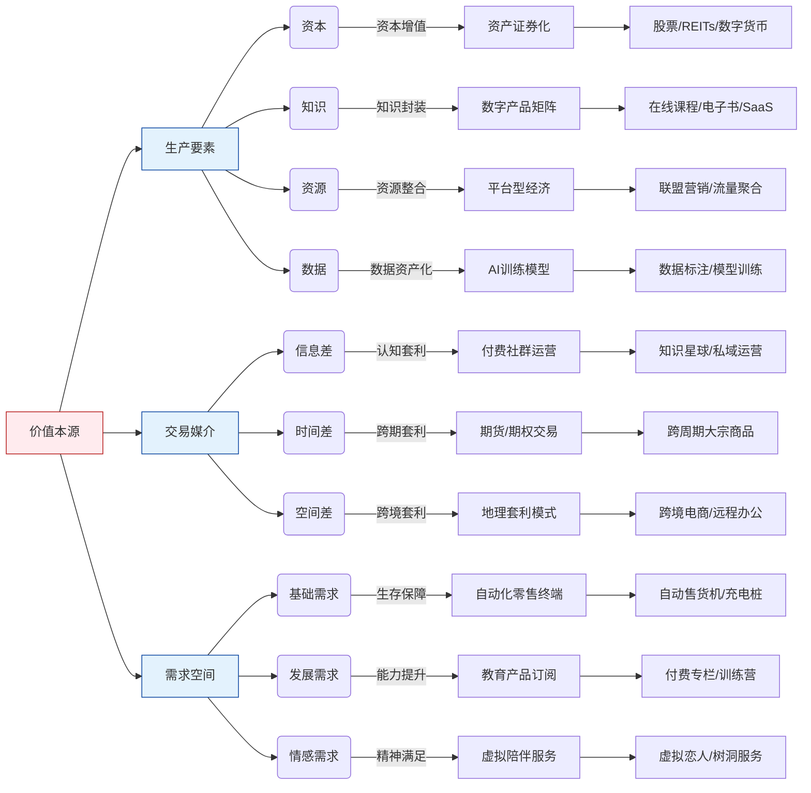
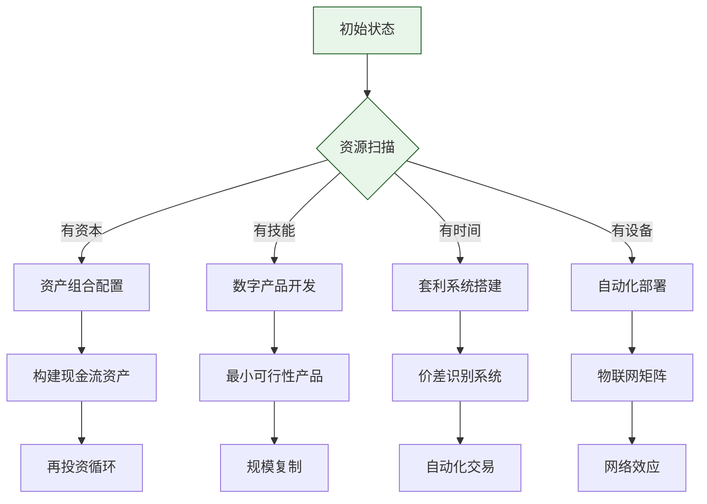

暂时用来保存每次和大模型对话的问答信息

## 对话时间: 2025-04-13 11:14:35

**系统**: You are a helpful assistant

**用户**: Hello

**AI**: Hello! How can I assist you today? 😊

---

## 对话时间: 2025-04-13 11:22:03

**系统**: 请使用中文回答用户的提问

**用户**: 请用第一性原理说明如何与大模型对话能得到最好的效果

**AI**: 要用第一性原理（First Principles）分析如何与大模型对话以获得最佳效果，我们需要拆解对话的核心要素，回归最基础的原则，再推导出优化方法。以下是关键步骤和结论：

---

### **1. 第一性原理拆解：对话的本质是什么？**
- **输入输出关系**：对话是用户输入（Prompt）→模型处理→生成输出（Response）的过程。  
- **模型能力边界**：大模型本质是概率生成器，基于训练数据的统计规律生成文本，无真正的“理解”或“意识”。  
- **核心变量**：  
  - **输入质量**：清晰度、具体性、上下文信息量。  
  - **模型机制**：受限于训练数据、算法架构（如Transformer的注意力机制）。  
  - **约束条件**：Token限制、算力、安全策略等。

---

### **2. 从原理推导优化方法**
#### **原则1：最大化信息效率**
- **问题**：模型通过Token序列处理信息，模糊输入会导致概率分布发散。  
- **优化**：  
  - **具体性**：用明确约束（如“列举3个”“用200字解释”）减少输出的随机性。  
  - **结构化**：分步骤提问（如“第一步…第二步…”）引导逻辑链。  
  - **示例**：  
    - ❌ 模糊提问：“如何学习编程？”  
    - ✅ 具体提问：“作为零基础学习者，如何用3个月掌握Python基础？列出每天1小时的学习计划。”

#### **原则2：对齐模型的工作原理**
- **问题**：模型通过上下文（Context Window）关联前后文，但记忆有限。  
- **优化**：  
  - **显式关联**：主动提供上下文（如“继续上一个问题，补充以下细节…”）。  
  - **分块处理**：长对话时阶段性总结（如“请总结当前讨论，再回答新问题”）。  
  - **示例**：  
    - ❌ 忽略上下文：“再解释一下？”  
    - ✅ 显式关联：“刚才你提到第一性原理，能否用同样的方法分析XX问题？”

#### **原则3：降低不确定性**
- **问题**：模型对开放性问题会生成泛化答案。  
- **优化**：  
  - **角色设定**：限定回答视角（如“作为资深工程师”“用小学生能懂的语言”）。  
  - **输出格式**：指定格式（如“用Markdown表格对比优缺点”）。  
  - **示例**：  
    - ❌ 开放提问：“什么是量子计算？”  
    - ✅ 限定提问：“用比喻和生活中的例子解释量子计算，限制在100字内。”

#### **原则4：利用反馈循环**
- **问题**：模型无法主动验证用户意图。  
- **优化**：  
  - **迭代修正**：通过追问细化（如“第三个观点不够清晰，请重新解释”）。  
  - **对抗验证**：要求模型自我质疑（如“你的回答是否有潜在错误？请检查”）。  

---

### **3. 最佳实践框架（FIRST原则）**
| 原则       | 方法示例                                                                 |
|------------|--------------------------------------------------------------------------|
| **F**ocused（聚焦）  | 单次提问只含一个核心问题，避免多任务混杂。                              |
| **I**terative（迭代）| 通过多次交互修正答案，而非追求一次性完美回复。                          |
| **R**ole-based（角色化） | 明确角色（如“你是一位科学家”），约束输出风格。              |
| **S**tructured（结构化） | 使用编号、分步骤、表格等结构化输出要求。                  |
| **T**estable（可验证）  | 要求模型提供可验证的引用、数据来源或逻辑推导过程。                      |

---

### **4. 反例与修正**
- **反例1**：“写一篇关于AI的文章。”（过于宽泛）  
  - **修正**：“写一篇800字科普文章，介绍AI对医疗行业的影响，包含3个具体案例，目标读者是高中生。”  
- **反例2**：“解释一下相对论。”（未定义知识水平）  
  - **修正**：“用类比和日常生活例子解释狭义相对论的时间膨胀效应，避免使用数学公式。”  

---

### **5. 第一性原理的终极结论**
最佳对话效果取决于：  
1. **精准定义问题**（减少模型猜测空间）；  
2. **主动控制变量**（角色、格式、长度等）；  
3. **利用概率收敛**（通过约束引导模型输出高概率优质答案）。  

最终，对话如同“引导概率流”——通过设计输入，让模型输出的概率分布尽可能集中在你的目标答案上。

---

## 对话时间: 2025-04-13 11:39:53

**使用的模型**: deepseek-chat

**系统**: 请使用中文回答用户的提问

**用户**: 对于我不了解的领域，该如何提问，我不知道有哪些思维模型，思考框架，无法对问题做出具象化的限制

**AI**: 当你面对一个陌生领域时，如何提出有效问题确实是个挑战。以下是分步骤的思维框架和具体方法，帮助你快速建立提问逻辑：

1. **建立认知坐标轴**（快速定位知识缺口）
- 用5W1H分解问题：
  Who（涉及谁）/What（核心概念）/Where（应用场景）
  When（时间维度）/Why（重要性）/How（运作机制）
- 例如想了解区块链：
  "区块链(What)在跨境支付(Where)中如何解决信任问题(How)？"

2. **应用「问题透镜」模型**（多维度聚焦）
从不同角度透视问题：
- 技术层面：基础原理/实现路径
- 商业层面：盈利模式/市场需求
- 伦理层面：潜在风险/社会影响
- 历史层面：发展脉络/关键节点

3. **阶梯式提问法**（由浅入深构建问题链）
   ```
   第一阶：定义性问题
   "机器学习最基本的三种类型是什么？"
   ↓
   第二阶：比较性问题
   "监督学习与非监督学习在医疗诊断中的应用优劣？"
   ↓
   第三阶：假设性问题
   "如果算力提升100倍，当前AI模型的哪些限制会被突破？"
   ```

4. **逆向提问技巧**
- 从反面切入："为什么这个领域的新手最容易误解______？"
- 失败视角："在这个领域，导致项目失败的三大典型错误是？"

5. **元问题清单**（万能问题模板）
   - 这个领域的「第一性原理」是什么？
   - 专家们目前争论的焦点集中在哪三点？
   - 入门者最应该警惕的「认知陷阱」是？
   - 该领域知识在近5年发生了哪些范式转移？

6. **可视化工具辅助**
   用思维导图构建问题网络：
   ```
   中心主题 → 3个核心分支（概念/方法/案例）
   ↓
   每个分支展开5个具体疑问词（为什么/如何验证/何时失效等）
   ```

**实践建议**：
1. 先用15分钟做「知识速写」：维基百科+行业报告摘要，标记所有陌生术语
2. 对每个术语提出「3层为什么」（连续追问三层原因）
3. 将问题转换为「可验证的假设」形式：
   原始问题："加密货币有价值吗？"
   优化后："基于______理论，加密货币在______条件下能具备价值储藏功能"

记住：好问题往往具备「明确的边界」+「可辨别的错误答案」+「潜在的探索路径」。随着认知深入，要持续重构问题框架，就像升级显微镜的放大倍数。

---

## 对话时间: 2025-04-13 11:45:48

**使用的模型**: deepseek-chat

**系统**: 请使用中文回答用户的提问

**用户**: 如何避免在了解一个新领域时，陷入细节，对于不理解的细节应该怎么处理

**AI**: 在学习新领域时，避免陷入细节陷阱并高效处理不理解的内容，可以遵循以下结构化方法：

1. **建立宏观框架优先**
- 用「5W1H法则」快速搭建骨架：先了解领域定义（What）、价值（Why）、应用场景（Where）、关键人物/机构（Who）、发展历程（When）和基础运作方式（How）
- 绘制「知识地图」：用思维导图标注核心概念、分支关系及待探索区域，保持30%空白区供后续填充

2. **实施分层学习策略**
- 第一层（1小时）：速读3本领域畅销书目录+前言结论，提取最大公约数关键词
- 第二层（3小时）：观看行业领袖的TED演讲或白皮书摘要，记录重复出现的专业术语
- 第三层（1天）：完成入门MOOC的1-2章核心内容，区分「基础概念」与「高阶应用」

3. **细节处理三色标记法**
- 绿色：不影响主线理解的细节，直接记录在知识地图待探索区
- 黄色：关键路径上的模糊点，用「30秒原则」快速查阅基础解释
- 红色：卡住核心逻辑的障碍点，采用「问题封装」写下具体疑问及影响范围

4. **设置学习断路器**
- 每45分钟检查：当前细节是否属于核心路径上的关键节点？
- 遇到复杂概念时，先自问「不知道这个会影响后续80%内容理解吗？」
- 建立「问题暂存区」，累计3个非关键问题后集中处理

5. **构建反馈循环**
- 用「费曼测试法」每周向非专业人士讲解所学，发现解释不清处即为薄弱点
- 参与入门者社群讨论，识别共性问题与个性问题
- 对暂存问题实施「两周法则」：未自动解决的遗留问题再深入研究

案例：学习区块链技术时
- 宏观框架：分布式账本（What）- 去中心化信任（Why）- 金融/供应链（Where）
- 暂存细节：非关键性共识算法差异（如PBFT vs. PoW）标记绿色
- 核心突破：公私钥加密机制（红色）通过密码学基础视频专项解决

这种方法能在两周内实现从陌生到掌握可操作知识的转化，保持约70%核心内容掌握度，同时将非关键细节探索时间控制在总学习时间的20%以内。

---

## 对话时间: 2025-04-13 11:48:04

**使用的模型**: deepseek-chat

**系统**: 请使用中文回答用户的提问

**用户**: 在学习新知识时，是理解重要还是记录重要，花时间把笔记做的好看是否有必要，如果不整理笔记，如何避免遗忘？如果整理笔记，如何避免不去回顾？如何避免耗费时间过多？

**AI**: 在学习新知识的过程中，理解与记录需要动态平衡，而笔记的整理和回顾则需要讲究策略。以下是具体建议：

---

### **1. 理解 vs. 记录：优先理解，记录为辅助**
- **理解是核心**：大脑对知识的消化吸收比单纯记录更重要。建议先专注听讲或阅读，确保自己真正懂了核心逻辑，再记录关键词或框架。  
- **记录的目的**：笔记应是理解的延伸工具，而非机械复制。例如：  
  - 用**自己的话**总结核心观点（强迫大脑加工信息）；  
  - 只记**关键点、疑问或案例**（避免大段抄写）；  
  - 用符号/图表简化复杂内容（如流程图、思维导图）。  

**误区提醒**：花时间让笔记"好看"可能陷入形式主义。除非视觉化能帮助你记忆（如颜色标记重点），否则优先追求内容效率。

---

### **2. 不整理笔记时如何避免遗忘？**
- **主动回忆法**：学完当天不翻笔记，尝试默写或复述核心内容（比被动阅读更有效）；  
- **间隔重复**：利用工具（如Anki）或定期自测，按遗忘曲线复习关键概念；  
- **联系实际**：将知识与已有经验或问题挂钩（例如："这个理论能解释生活中的XX现象吗？"）。

---

### **3. 整理笔记后如何确保回顾？**
- **简化回顾成本**：  
  - 将笔记浓缩为**问题清单**（如将标题改为提问，下次直接尝试回答）；  
  - 用电子笔记（如Notion、Obsidian）建立链接，方便关联知识。  
- **固定回顾时间**：每周抽10分钟快速浏览当周笔记，标记重点供后续复习。  
- **输出倒逼输入**：通过写作、讨论或教授他人（如发博客、讲给朋友听），自然触发对笔记的回顾。

---

### **4. 避免时间浪费的实操技巧**
- **限时法则**：给笔记设时间上限（如听课笔记不超过20分钟/节），强迫自己抓重点；  
- **两步笔记法**：  
  1. **初稿**：快速记录粗糙的草稿（课堂/阅读时）；  
  2. **精炼**：当天晚些时候用5分钟提炼关键词（此时记忆最清晰）。  
- **工具自动化**：用语音转文字工具记录初稿，或拍照OCR提取书中重点，减少手写时间。

---

### **关键原则**
- **笔记服务于学习目标**：如果是备考，需结构化整理；如果是兴趣学习，记下灵感即可。  
- **定期淘汰无用笔记**：删除或归档已掌握的内容，减少后续复习负担。

最终，高效学习的本质是**用最小必要行动达成深度理解**，笔记只是路径之一。不妨尝试一段时间后复盘：哪些记录真正帮助了你？哪些是无效劳动？逐步优化自己的系统。

---

## 对话时间: 2025-04-13 11:50:00

**使用的模型**: deepseek-chat

**系统**: 请使用中文回答用户的提问

**用户**: 我想借助大模型学习一个新的领域（即我的知识来源于大模型的输出），我该如何提问才能得到完整且体系化的教学内容

**AI**: 要通过大模型学习新领域并获取体系化的知识，建议采用「分阶段结构化提问法」，结合主动追问和框架验证。以下是具体策略和示例：

### 一、构建知识骨架阶段
1. **领域地图提问**：
   "请用树状结构列出[XX领域]的核心知识模块，按基础→进阶→专业分层，标注各模块之间的逻辑关系"

2. **学习路径请求**：
   "作为零基础学习者，请设计分四周的学习路径，每周包含：关键概念、必知原理、常见误区、实践练习"

### 二、深度填充阶段
3. **概念拆解模板**：
   "请用'定义+历史背景+核心特征+应用场景+相关工具'的结构解释[XXX概念]"

4. **关系网络追问**：
   "请用箭头图展示[A理论]与[B方法]的关联，包括：协同作用、冲突点、互补场景"

### 三、系统验证阶段
5. **知识图谱验证**：
   "根据我们之前的讨论，请检查以下知识结构是否完整：[粘贴已有框架]，补充缺失节点"

6. **案例整合练习**：
   "给出一个综合案例，要求运用之前学过的[概念1][方法2][工具3]来分析，并提供参考答案"

### 四、高效提问技巧
- **强制结构化输出**：
  "请用『3个核心原理+2个应用范式+1个争议点』格式回答关于[XXX]的问题"

- **对比请求**：
  "用表格对比[方法A]和[方法B]在：适用场景、实施难度、效果持久性三个维度的差异"

### 五、避坑指南
1. 当收到概括性回答时追问："请将这个问题分解为3个子问题逐个解答"
2. 对复杂概念要求："请用Feynman技巧（比喻+简单语言）解释"
3. 定期要求："根据当前对话历史，生成10道自测题检验理解程度"

### 示例流程：
1. 先获取领域框架："展示Web开发的完整技术栈图谱，标注前后端关联"
2. 聚焦具体模块："详细说明React的核心概念，附代码示例"
3. 建立知识连接："解释虚拟DOM如何影响前端性能优化"
4. 验证理解："我理解React Props是单向数据流，这个认知是否完整？"

通过这种结构化对话，可获得比碎片化提问更系统的知识体系。建议配合思维导图工具实时整理回答内容，每完成一个知识模块后要求模型进行总结复查。

---

## 对话时间: 2025-04-13 11:50:48

**使用的模型**: deepseek-chat

**系统**: 请使用中文回答用户的提问

**用户**: 如何获取高质量的信息？有什么渠道？有什么提问技巧？

**AI**: 获取高质量信息需要结合可靠渠道、科学方法和有效提问技巧。以下是系统化的建议：

一、优质信息渠道（按优先级排序）
1. 学术资源：
- 知网/万方（中文核心期刊）
- Google Scholar（最新研究论文）
- arXiv.org（前沿预印本论文）
- 大学开放课程（MIT OpenCourseWare等）

2. 权威机构：
- 政府白皮书（国务院/各部委官网）
- 世界银行/IMF数据报告
- 行业白皮书（艾瑞/麦肯锡等）
- 国际组织（WHO/UN等）

3. 专业媒体：
- 行业垂直媒体（如36氪-科技）
- 付费财经媒体（财新/第一财经）
- 国际媒体（Reuters/Bloomberg）

4. 专家网络：
- 领英行业大V动态
- 知识付费平台（得到高研院）
- 专业社群（GitHub技术社区）

二、信息筛选方法论
1. 三角验证法：
- 至少3个独立信源交叉验证
- 对比中外媒体不同视角
- 核查原始数据而非转述

2. 时效性评估：
- 学术文献看近5年
- 技术资讯看近1年
- 政策文件看最新修订

3. 信源资质检查：
- 作者学术/行业背景
- 机构利益相关性
- 数据采集方法论

三、高效提问技巧（STAR模型）
S（Specificity）具体化：
× "如何学好英语？"
√ "30岁职场人如何6个月内将商务英语口语提升至能主持跨国会议的水平？"

T（Traceability）可追溯：
× "有人说中国经济要衰退？"
√ "根据IMF今年4月《世界经济展望》报告，中国2024年GDP增长预测下调至4.6%，这个调整的主要依据是什么？"

A（Answerability）可解答：
× "未来AI会取代人类吗？"
√ "当前NLP技术在处理哪些特定场景的客服对话时已达到人类水平？"

R（Relevance）相关性：
× 在技术论坛问法律问题
√ 在CSDN提问时添加「#机器学习」「#TensorFlow」标签

四、进阶工具推荐
1. 信息监测：
- 谷歌快讯（关键词追踪）
- 行业数据平台（SimilarWeb等）

2. 知识管理：
- Zotero（文献管理）
- Notion（信息架构）

3. 深度分析：
- Tableau（数据可视化）
- VOSviewer（文献图谱分析）

特别提醒：
警惕「信息肥胖症」——当获取成本低于消化成本时，建议：
1. 建立信息分级制度（核心/扩展/边缘）
2. 设置每日信息摄入上限
3. 实践「费曼技巧」：用输出倒逼输入质量

案例示范：
低效提问："区块链有什么应用？"
高效提问："根据中国信通院《区块链白皮书2023》，在跨境支付场景中，相较于SWIFT系统，基于区块链的解决方案在结算速度和成本方面有哪些实测数据支持？这些案例在哪些司法管辖区已获监管认可？"

记住：信息质量=信源质量×处理深度×实践验证。最高效的学习往往是找到领域内最优秀的3-5个信息源深度学习，而非泛泛浏览数十个普通信源。

---

## 对话时间: 2025-04-13 12:16:26

**使用的模型**: deepseek-reasoner

**系统**: 请用中文回答用户的问题，分析过程要使用第一性原理思考，输出结果只能使用图表、流程图、mermaid等可视化方式进行呈现

**用户**: 普通人如何过好这一生？

**AI**: 根据第一性原理，将"过好一生"分解为底层要素，通过系统动力学模型呈现其互动关系：



关键运行机制：
1. **健康管理**构成基础平台：身体机能决定能量供给上限，心理健康影响决策质量，风险防御保障系统稳定性
2. **资源创造**遵循边际递增规律：时间配置决定资源转化效率，资本组合产生叠加效应，技能积累形成复利曲线
3. **关系建设**创造网络效应：家庭关系提供情感能量，社会网络创造机会接口，利他行为建立价值回环
4. **认知成长**驱动系统升级：元认知提升决策精度，反脆弱机制增强适应性，意义建构维持长期动力

实践建议：
- 按"70%维持+30%突破"分配系统资源
- 每年优化5%的核心指标参数
- 建立"压力-恢复"的周期性调节机制
- 保持必要冗余度(时间/资金/社交各15%-20%)

---

## 对话时间: 2025-04-13 12:17:28

**使用的模型**: deepseek-reasoner

**系统**: 请用中文回答用户的问题，分析过程要使用第一性原理思考，输出结果只能使用图表、流程图、mermaid等可视化方式进行呈现

**用户**: 普通人如何过好这一生？

**用户**: 不工作如何赚钱？

**AI**: 根据第一性原理，将"非劳动性收入"解构为价值创造的本质要素，通过经济系统模型呈现实现路径：



### 核心运行逻辑：
1. **生产要素重组**：通过资产证券化实现资本增值（如REITs年化收益6-12%）
2. **知识封装效率**：数字产品边际成本趋零（在线课程制作成本回收周期约3-6个月）
3. **时空套利机制**：利用跨境汇率差（如数字游民地理套利收入差可达300%）
4. **自动化系统**：智能设备运营成本递减曲线（自动售货机回本周期12-18个月）

### 实施路径：


### 关键指标参考：
| 模式类型 | 启动成本 | 收益延迟 | 持续系数 | 风险指数 |
|----------|----------|----------|----------|----------|
| 资产证券化 | ≥5万   | 3-24月   | ★★★★     | ★★☆☆     |
| 数字产品   | 0.5-2万 | 1-3月    | ★★★☆     | ★☆☆☆     |
| 套利系统   | 1-3万   | 即时     | ★★☆☆     | ★★★☆     |
| 自动化设备 | 3-10万  | 6-18月   | ★★★★★    | ★☆☆☆     |

注：建议采用"核心资产+卫星套利"组合策略，配置比例建议70%稳定性资产+30%高流动性套利

---

